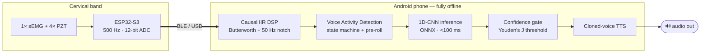

# speechfree
<div align="center">

# SpeechFree

**A wearable silent speech interface that restores voice for laryngectomy patients — without surgery, batteries that last 12+ hours, or an internet connection.**

[]()
[]()
[](LICENSE)
[]()
[]()

</div>

---

## The problem

A total laryngectomy permanently removes the larynx. Roughly **150,000 patients worldwide** every year lose biological phonation overnight. The three existing voice-restoration options each carry serious limitations:

| | Speech quality | Hands-free | Surgical burden | Daily cost |
|---|---|---|---|---|
| **Electrolarynx** | Robotic, monotonic | ❌ requires holding | None | Battery only |
| **Esophageal speech** | Natural-ish | ✅ | None | None, but >70% fail to master it |
| **Tracheoesophageal puncture** (gold standard) | Most natural | Partial | Surgery + frequent prosthesis replacement | Daily hygiene, fungal biofilm, leakage |

SpeechFree is a **fourth option**: a non-invasive wearable that decodes speech *intent* directly from neck-surface biosignals and re-vocalizes it in the patient's own pre-operative voice.

---

## How it works



Every step — sampling, filtering, segmentation, inference, synthesis — runs **on-device**. Biometric data never leaves the phone (KVKK/GDPR compliant by design).

## Key engineering decisions

- **5-channel sensor fusion (1 sEMG + 4 PZT)** on a 12 g custom 3D-printed PLA cervical band. EMG fires the trigger; PZTs encode spatial articulation patterns. Ablation showed PZTs contribute +25% accuracy vs. EMG's +1.0%.

- **Bit-exact Python ↔ Kotlin parity.** SciPy generates the Butterworth + 50 Hz notch coefficients, exports them to JSON, and the Kotlin pipeline ingests the same coefficients. No reimplementation, no drift.

- **Causal-only DSP.** `filtfilt` is banned anywhere in the training code. Real-time inference can't look ahead, so the training pipeline can't either. This is the single most common silent killer in deployed ML.

- **VAD state machine with pre-roll buffer.** A 100 ms ring buffer prepends historical samples on every `SILENCE → SPEAKING` transition, capturing the consonant onset that threshold-based detectors usually clip off.

- **Confidence gate via Youden's J statistic.** Mathematically derived softmax threshold from the validation-set ROC curve, suppressing false-accepts from coughs, swallows, and head movement.

- **Channel-dropout augmentation.** During training, a random PZT channel is zeroed with p=0.1 — forcing the network to spread its learned features across the array. A loose wire in deployment degrades gracefully instead of catastrophically.

---

## Results (pilot session, 10-class Turkish vocabulary)

Vocabulary: `EVET, HAYIR, MERHABA, TESEKKURLER, SU, YARDIM, TAMAM, DUR, GEL, GUNAYDIN`

| | Top-1 | Top-3 |
|---|---|---|
| Random chance (10 classes) | 10% | 30% |
| **Random Forest baseline** (within-session) | **67%** | **87%** |
| **1D-CNN** (cross-session, kayit1 → kayit3) | **52%** | **75%** |
| VAD word-level match rate (k=1.5) | 66% | — |
| Mean VAD onset error | 710 ms | — |
| 1D-CNN inference latency (Android CPU) | <100 ms | — |
| End-to-end pipeline (sense → speak) | <300 ms | — |

**Best-classifying words:** `DUR`, `TAMAM`, `GEL` (sharp stop-onset articulation, 80% cross-session). **Worst:** `MERHABA`, `HAYIR` (gradual fricative onsets that confuse the EMG-only VAD — motivates the next iteration's PZT-aware VAD).

Full ablations, ROC curves, and confusion matrices in [`docs/FENS402_Final_Report.pdf`](docs/FENS402_Final_Report.pdf).

---

## Tech stack

**Hardware** — ESP32-S3 · Arduino Uno (PoC) · 4× 25 mm PZT discs · sEMG bipolar pair · TL072 op-amp buffers · 9 V isolated supply · 3D-printed PLA housing (12 g, CATIA + FDM)

**Embedded** — C/C++ · Timer1 CTC interrupts · direct ADCSRA register access · UART @ 250 kbaud · custom marker injection protocol

**Data acquisition** — MATLAB · automated clinical protocol · signal-quality pre-flight (saturation, mains, baseline, A/B ratio) · session metadata schema

**ML pipeline** — Python 3.11 · PyTorch · scikit-learn · SciPy · ONNX (Opset 14) · Random Forest baseline · 1D-CNN (4 conv blocks, GAP, ~250k params)

**Android edge** — Kotlin · Jetpack Compose · Dagger-Hilt · Room DB · DataStore · Kotlin Coroutines/Flow · ONNX Runtime · Foreground Service

**Voice cloning** — VITS (Turkish fine-tune) · ElevenLabs API · custom phoneme cleaners

---

## Repository structure
Each subfolder ships its own README with setup and usage.

---

## Getting started

### Run the ML pipeline (Python)

```bash
cd TextRecon
pip install torch scikit-learn scipy numpy onnx onnxruntime
python build_dataset.py        # compile dataset.npz from recordings
python rf_baseline.py          # Random Forest baseline (~67% within-session)
python train.py                # train 1D-CNN
python export_onnx.py          # export to ONNX for mobile
```

### Flash the firmware (Arduino IDE)

See [`Final/README_KAYIT.md`](Final/README_KAYIT.md) for ESP32-S3 wiring, op-amp piezo buffers, and the MATLAB acquisition protocol.

### Generate TTS assets (voice cloning)

See [`TTS/06_deliverable/README_YIGIT.md`](TTS/06_deliverable/README_YIGIT.md) for the ElevenLabs pipeline and the Kotlin player integration.

---

## Standards & compliance

Designed against: **IEC 60601-1 / -1-2 / -1-11** (medical electrical safety, EMC, home-use), **IEC 62304** (medical-device software lifecycle), **ISO 10993-5 / -10 / -23** (cytotoxicity, sensitization, irritation), **TİTCK / EU MDR 2017/745** (medical device regulation), **KVKK / GDPR** (biometric data — Privacy-by-Design), **EU RoHS** (PZT exemption 7(c)-I + planned closed-loop take-back).

---

## Team

Kadir Has University · Electrical & Electronics Engineering · FENS 402 — Engineering Design Project · Group 10

- **Tuğrul Altınüzengi** — Signal processing, ML pipeline, Android inference layer
- Serhat Yalçın
- Mert Kaçmaz
- Yiğit Efe Ayhan

**Supervisor:** Yalçın Şadi · **Submitted:** May 2026

---

## License

[MIT](LICENSE).

**Disclaimer:** Academic research prototype. Not a certified medical device. Do not use for clinical purposes without full regulatory validation.
